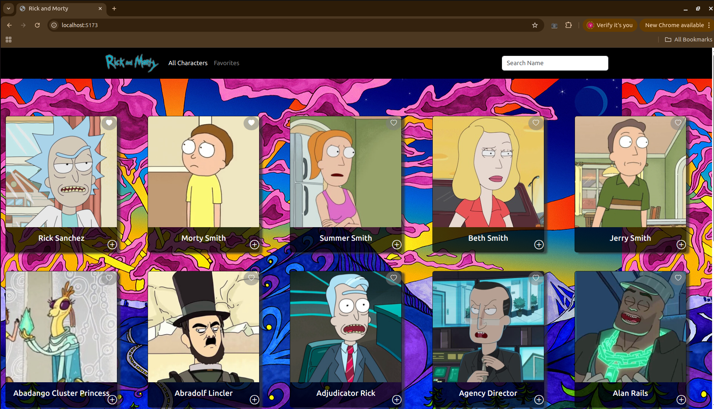

# 🛸 Rick and Morty Favorites

Welcome to **Rick and Morty Favorites**, a fun React-based app that lets you explore characters from the **multiverse** using the official Rick and Morty API. Mark your favorite characters 💚 and dive deeper into their details with smooth routing!

---

## 📸 Preview

  
*Explore, favorite, and learn more about your favorite Rick and Morty characters!*

---

## ⚙️ Tech Stack

- ⚛️ **React**
- 🚀 **Vite**
- 🔁 **React Router DOM**
- 🌐 **Axios**
- 💅 **Bootstrap** (optional)

---

## ✨ Features

✅ Fetch characters from the [Rick and Morty API](https://rickandmortyapi.com/)  
💾 Save and view your favorite characters  
🖼️ Card layout with dynamic data  
➕ Click the `+` icon to view full character details  
🌍 Seamless navigation with React Router
🔍 Search bar for filtering characters by name  

🛡️ License
MIT © vale-salvatierra
